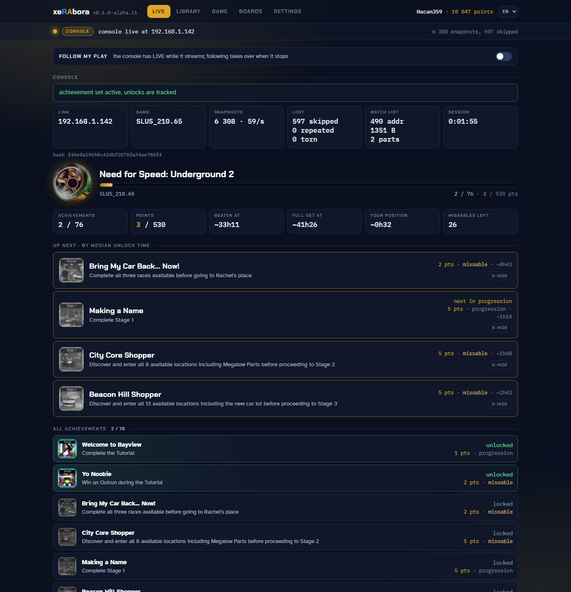
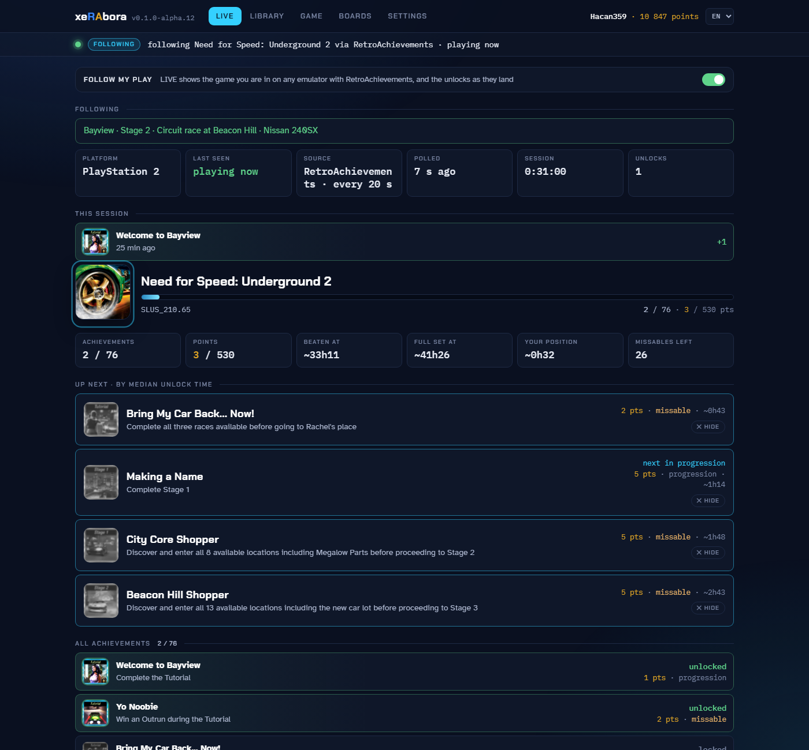
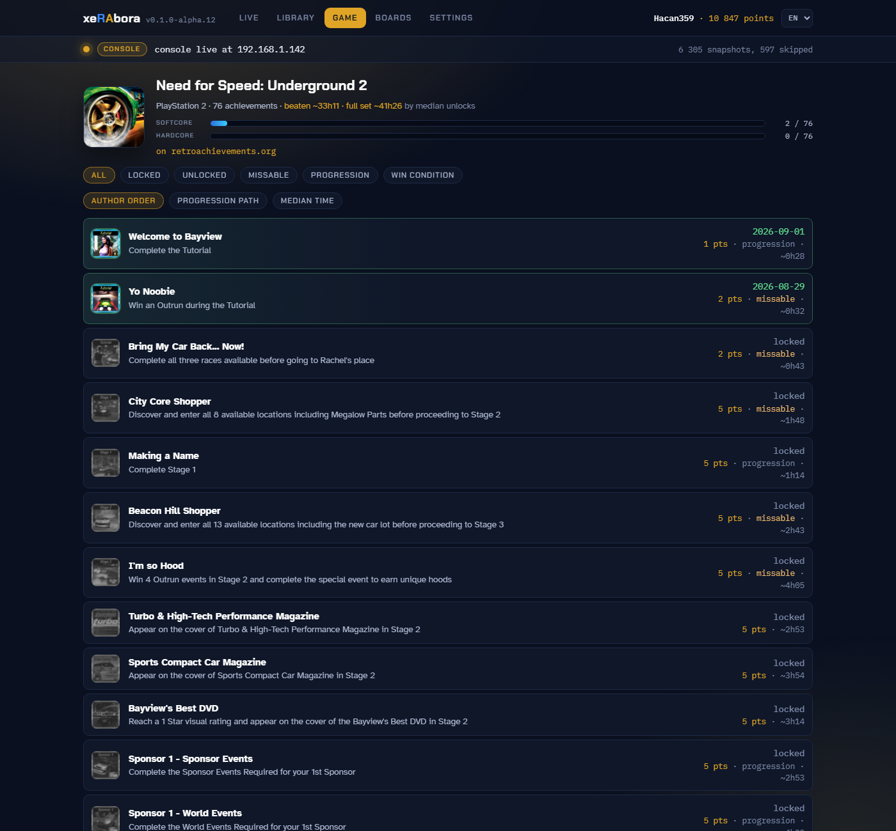
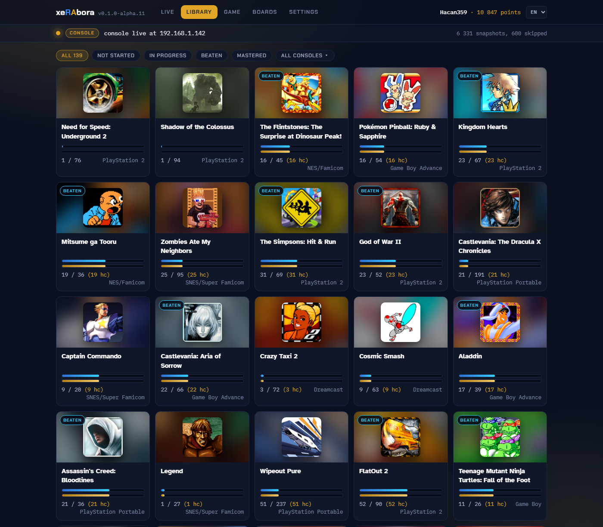
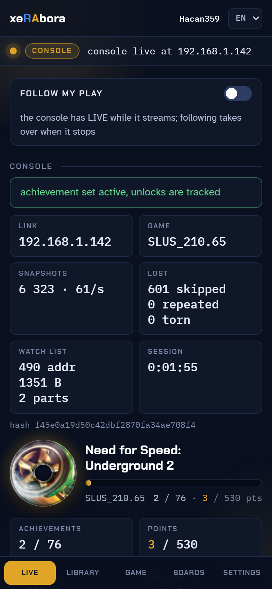

<p align="center">
  
</p>

# xeRAbora

Two things in one repository. The first is RetroAchievements on a real
PlayStation 2: a fork of Open PS2 Loader reads the running game's memory
and streams it to a PC, which runs rcheevos and unlocks the achievement
on your profile. No emulator. The second is xeRAbora itself, a desktop
RetroAchievements client that works with or without that console: your
library, each game's achievements, leaderboards, and your account's
activity from any emulator. The console is one live source for it.

**Project page:** [hacan359.github.io/xerabora](https://hacan359.github.io/xerabora/),
the setup as a walkthrough: [How to start](https://hacan359.github.io/xerabora/#start).

> [!WARNING]
> **Experimental.** A hobby project in alpha. The PS2 side is tested with
> games on a USB stick and from the original disc, on two consoles. Use
> it at your own risk.

<p align="center">
  
</p>

---

# Part one: achievements on a real PlayStation 2

## How it works

```
PS2 game ──► ee_core reads watched addresses every frame (VBLANK)
         ──► SIF DMA ──► raudp (IOP) builds UDP frames, bypasses the TCP/IP stack
         ──► Ethernet ──► xerabora on the PC ──► rcheevos ──► retroachievements.org
                      ◄── RAU1 unlock notice ◄──
```

The console never talks to RetroAchievements. Before you play, the
loader hashes the image the RetroAchievements way and asks the PC. The
PC fetches the achievement set, derives every memory address the set
reads, and sends that *watch list* back. While you play, the in-game core
copies those addresses into a snapshot every frame and `raudp` on the
IOP sends it as UDP packets, one for most sets and up to nine for the
biggest, built by hand and handed straight to the network driver so the
game's own traffic is never blocked. On the PC, rcheevos (the engine the emulators use) evaluates
the achievements against the snapshots. When one unlocks, the PC sends
a notice back and the console flashes the screen gold by writing two
GS registers. Nothing is written into the game or the image.

The PS2 agent is a fork of [Open PS2 Loader](https://github.com/hacan359/Open-PS2-Loader/tree/ra),
branch `ra`; it ships as `OPL-RA.ELF` with every release here and
behaves like OPL 1.2.0 with extra items in the menus.

## What you need

- A PS2 with a network adapter and a way to run OPL (FMCB, FHDB or similar).
- Your game images on a USB stick, or the original disc in the drive. These
  two we have tested, and they are the ones to play from. A game with an
  achievement set does not run from a network share; a game without one
  does. An internal HDD with an exFAT partition, which OPL reads over
  BDM, behaves like the stick for one tester; games on HDL partitions
  are not hashed.
- A PC on the same local network, Windows, Linux or macOS.
- A [RetroAchievements](https://retroachievements.org) account.

## Setup

An unlock needs three things, in this order: `xerabora` running on the PC
and signed in, the game checked once with **RA: check game support**, and
only then the game started. Step 6 is the one people skip. A game you
never checked starts as plain OPL, without telemetry, and the client
shows nothing for it.

1. Download `OPL-RA.ELF` and the client for your PC from the
   [releases](../../releases): `xerabora.exe` (Windows),
   `xerabora-linux-x86_64` (Linux) or `xerabora-macos` (macOS, Intel and
   Apple Silicon in one file). On Linux and macOS, `chmod +x` the file
   after downloading.
2. Put `OPL-RA.ELF` where you keep your OPL and launch it instead of OPL.
3. The RA menu items report their result as an on-screen notice whatever
   OPL's **Notifications** setting says. Turn that setting on if you also
   want OPL's own notices.
4. Run `xerabora` on the PC. It opens its page in your browser. On the
   **SETTINGS** tab sign in with your RetroAchievements login (needed for
   unlocks) and paste the Web API key from your RA profile settings (it
   fills the library, leaderboards and profile). The login token and the
   key are kept in your user profile (`%LOCALAPPDATA%\xerabora` on Windows,
   `~/.config/xerabora` on Linux and macOS); the password is not stored.
5. On the console, select a game, open its menu (triangle) and choose
   **RA: test PC connection**. A notice tells you whether `xerabora` answered,
   from which address and how fast. If nothing answers, check that the PC
   is on the same network and that the firewall allows inbound UDP 18194.
6. In the same menu choose **RA: check game support**. Do this before you
   start the game, once per game: it fetches the list of addresses the
   console will read, and without it there is nothing to track. The
   notice shows the game title and the achievement counts (total,
   unlocked, unsupported). Supported games get an `RA` prefix in the list
   and a badge on the cover art. `RetroAchievements does not know this
   image` means the game plays without achievements; a set the PC
   refuses is named with its reason (wrong dump, server down).
7. Start the game. Within about 30 seconds the **LIVE** tab shows the
   console connected, the set and the first snapshot. An unlock shows on
   the page, on your profile, and as a short gold flash over the game on
   the console.

The full walkthrough is in [docs/USAGE.md](docs/USAGE.md); the same
steps are on the [project page](https://hacan359.github.io/xerabora/#start).

## Playing from the original disc

Put the disc in the drive, press START for OPL's main menu and choose
**RA: check disc support**, then **RA: launch disc**. The check reads the
disc through the console's own driver and asks the PC the same way it
does for an image; the launch boots the disc under OPL's in-game hooks,
so telemetry and unlocks work as they do from USB. In this mode OPL's
virtual memory cards, per-game compatibility patches and cheats are not
available: they live inside the part of OPL that emulates the drive,
which a real disc does not use.

Disc mode is experimental. It has been verified with Shadow of the
Colossus only; a game it cannot boot may hang the console hard (black
screen, the reset button does nothing). Power the console off and back
on to recover. Transformers: The Game is one known case.

## What the console side does not do

- **Hardcore.** OPL can write to game memory through its cheat engine,
  so the client does not claim hardcore mode. Every unlock is softcore.
  Whether a real-hardware client can ever qualify is the RA team's call.
- **Deep pointer chains.** The console follows pointers now, up to 128
  chains per game. A set that needs more keeps its direct reads and
  drops the chains; the client counts what it could not compile and says
  so. A chain is also left out when its offset is not constant or its
  parent is a delta read. Beyond Good & Evil, the worst case measured,
  has 31 of 115 out of reach; X-Men Origins and TMNT have none.
- **Another subnet.** The console learns the PC's MAC address from the
  discovery reply; a PC behind a router is heard but cannot be answered.
- **Other image formats.** The check reads plain ISO images whose boot
  executable sits in the root directory (all retail discs do), named
  `Title.iso` or the OPL Manager way, `SLUS_123.45.Title.iso`. ZSO and
  UL images are not hashed, and HDD games sit on HDL partitions the
  hasher does not read.
- **Games without libpad.** Telemetry starts when the game opens its
  controller through libpad, which is how OPL's in-game hooks attach. A
  game with unusual input code may never start sending; the PC then
  shows no snapshots.
- **The data cache.** Reads see RAM, not the EE data cache, so a value
  the game wrote very recently can lag by a fraction of a frame.
- **A disc the drive cannot read all the way** fails the check with
  "could not read SYSTEM.CNF". That is the disc or the laser, not the
  software.

---

# Part two: xeRAbora, the RetroAchievements client

Everything below works without a console. What the client knows comes
from three places: your **Web API key** (read-only, fills everything you
browse), your **login** (needed only to unlock), and, when one streams,
**the console** (the only source of measured progress and live
trackers). Here is what each tab shows and where it comes from, with the
refresh rate, so you know what is live and what is a poll.

## What it shows, and where the data comes from

| Tab | What you see | Source | Refresh |
|---|---|---|---|
| **LIVE**, console streaming | The running game as the console sees it: each achievement's state, measured progress ("3 of 10"), UP NEXT by the median time other players took (HIDE drops one you gave up on and the next median takes its slot), missable warnings, live leaderboard trackers, a CONSOLE panel with the link, the snapshot rate and the losses, and a strip with points, the time the set costs and where you stand in it. Sets with subsets list each subset under its own heading. | rcheevos on the console's snapshots; medians from the Web API | every frame |
| **LIVE**, following | The game your account is in on any emulator with RetroAchievements, the rich presence line, whether the server sees you online, this session's unlocks, UP NEXT and the missable warnings. No measured progress and no trackers: those need a memory source. | Web API (profile, recent unlocks) | every 20 s, the online flag once a minute |
| **LIBRARY** | Every game your account has touched, up to 500: two bars per game, softcore and hardcore, the highest award in the corner of the cover, filters by status and console. Not the whole RetroAchievements catalogue: only what you have played. | Web API (completion progress) | cached 2 min |
| **GAME** | One set in full: the author's order, the intended path (progression, win condition, missables flagged) or the median-time order; each achievement's points, unlock date and median. A game's subsets and its main set as a strip of chips, so you move between them without leaving the tab. | Web API (game info, game progression, the console's game list for subsets) | cached 30 s |
| **BOARDS** | A game's leaderboards with the top entry and your own, and, when the console plays, the trackers moving with the game. | Web API; trackers from the console | on open |
| **Header** | Your name and points. The language menu: English, Brazilian Portuguese, Spanish. | Web API (profile) | on load |

Unlocks reach your profile the moment rcheevos fires them, with a toast
on the page, a short sound on the PC and the gold flash on the console.

<p align="center">
  
  
</p>

## What it does not do

- It **does not post leaderboard entries.** The trackers run and show
  on BOARDS, but RetroAchievements takes entries from hardcore only.
- It **does not claim hardcore**, for the reason in part one.
- It **does not browse the catalogue.** Games open from your library;
  there is no search across RetroAchievements.
- It **does not know which emulator you are in** when following. The
  Web API exposes the game, the platform and the rich presence line,
  nothing about the emulator or its core.
- It **does not translate RetroAchievements' text.** Achievement titles
  and descriptions, game titles and rich presence come from the server
  in English. The three languages cover the page itself.
- It **does not work offline.** Every tab is the Web API or the console;
  there is no local copy of your library.
- It **does not write anything to RetroAchievements** beyond the unlocks:
  no comments, no claims, no awards.

## The client itself

The interface is a page the client serves to itself on `localhost`,
compiled into the executable. One copy runs at a time; a second start
opens the running copy's page. The client exits by itself about 15
seconds after its last page is closed, and at once from the red **QUIT**
in the footer.

- **The look follows the source.** Idle, the page is blue-grey. While a
  console streams it turns gold and the cover spins as a disc that slows
  and stumbles on lost snapshots. While following an emulator it turns
  blue, with a ring around the cover.
- **Settings** hold the account, the Web API key and the network switch.
  Login is optional: the library, the game view and the boards work on
  the key alone; unlocking needs the account.
- **FOLLOW MY PLAY** is the switch at the top of LIVE. On by default;
  the console takes over the moment it connects.
- **Language** is the menu in the header, remembered by the browser
  that chose it: a phone can read the page in Spanish while the PC stays
  English. `#lang=es` in the address does the same for one window.
- **On a phone.** OPEN TO THE NETWORK on SETTINGS serves the page to
  your Wi-Fi; type the address it shows into a phone or tablet and add
  the page to the home screen. Up to four pages watch at once. Other
  devices see everything; the login, the key, the switches and QUIT
  work only from the PC that runs the client. On a narrow screen the
  tabs move to a bar along the bottom.
- **Stream-ready.** OBS takes the page as a browser source; `--obs DIR`
  writes text labels and a `data.json` for everything else. `#tab=live`
  opens a window straight on a tab.
- **Sounds** on connect, on a stream that stops for five seconds, and on
  an unlock. `--no-sound` turns them off; your own `connect.wav`,
  `disconnect.wav` or `achievement.wav` in the `sounds` folder next to
  the saved login replace them. Linux plays through `paplay`, `aplay` or
  `pw-play`; macOS through `afplay`.
- **One file.** Windows, Linux or macOS, nothing to install. On Windows
  a double click opens the page and no console window; `--console` opens
  one. Everything is also written to `xerabora.log` next to the saved
  login. macOS keeps a downloaded file under quarantine, so the first
  run stops with a warning: `xattr -dr com.apple.quarantine
  xerabora-macos`, or open the file once from Finder's right-click menu.
  We do not sign the build; signing takes a paid Apple developer account.

<p align="center">
  
  
</p>

## Any hardware, one protocol

The client knows nothing about the PS2. It identifies a game by the hash
an agent sends, asks the RetroAchievements server for the set, derives
the list of memory addresses the set reads, and hands that watch list to
the agent. From then on the agent streams those addresses every frame
and the client runs rcheevos. Unlock notices go the other way.

The whole exchange is a handful of UDP messages, documented in
[`protocol/PROTOCOL.md`](protocol/PROTOCOL.md). An agent for another
console needs to read that console's memory, compute the RetroAchievements
hash, and speak the protocol. The client does the rest.

---

## Where this is going

- **Deeper pointer chains, more image formats.** The console follows
  chains up to 128 per game; raising that ceiling and hashing ZSO images
  are the next console-side pieces.
- **Guidance wherever you play.** UP NEXT, missable warnings and the
  progression order come from RetroAchievements data, so they work for
  any game you have started, on the console, on a PC or in an emulator.
  The goal is a companion that walks you through a set so you miss
  nothing on the way to mastery.
- **More agents, one protocol.** An agent for another console, or for an
  emulator that wants the same window, speaks the protocol and the
  client does the rest.
- **Louder unlocks.** Controller rumble in step with the flash, a badge
  on the TV, a mastery alert on the page, Discord presence.
- **For streams.** A compact overlay layout for OBS, live counters from
  the game's own values, leaderboard trackers beside the video.
- **Hardcore.** RetroAchievements decides who qualifies; the question is
  with the RA team.

## Building

**OPL fork** needs the ps2dev toolchain. The simplest route is the same
container the OPL project uses:

```
docker run --rm -v "$PWD":/src -w /src/opl ghcr.io/ps2homebrew/ps2homebrew:main make PADEMU=0 all
```

`make RA_DEBUG=1 all` builds the debug variant: it writes the loader's
module results to `RA/launch.txt` on the share. Inside the game it does
nothing extra.

**PC client** (`client/`) builds on its own, without the OPL fork: it
needs only rcheevos and the headers in `protocol/`. `make` on Linux needs
gcc and libcurl development headers. `make windows` cross-compiles a
static `xerabora.exe` with MinGW-w64 (`gcc-mingw-w64-x86-64` on
Debian/Ubuntu); HTTPS goes through WinHTTP, so the Windows build has no
external dependencies. `make macos` builds one file holding both Mac
architectures, against the libcurl the system ships.

The page is written in `client/ui/src`: a skeleton, one stylesheet per
concern, one script per tab, with Preact, htm and signals vendored in
`client/ui/vendor`. `python3 tools/build-page.py` (from `client/`)
assembles `ui/index.html`, embeds it into `src/ui_page.c` and rebuilds
`docs/demo.html`; `--watch` does that on every save. While working on
it, `--ui-file client/ui/index.html` serves the assembled page from disk
without a rebuild of the client.

Both the OPL fork and rcheevos are git submodules. Clone with
`--recurse-submodules`, or run `git submodule update --init --recursive`
after cloning. Building the client needs only `third_party/rcheevos`; the
`opl` submodule is there to build the console loader.

## Repository layout

| path | contents |
|---|---|
| `client/` | the PC client: the RetroAchievements client, its page (`ui/`), the protocol side |
| `protocol/` | the wire protocol &mdash; [`PROTOCOL.md`](protocol/PROTOCOL.md) plus the shared `ra_snap.h` / `ra_watch.h` |
| `opl/` | submodule &rarr; the [OPL+RA fork](https://github.com/hacan359/Open-PS2-Loader/tree/ra), the PS2 agent. RA additions: `src/ra*.c`, `ee_core/src/ra.c`, `ee_core/src/ra_overlay.c`, `modules/network/raudp`, `modules/network/ps2ips-ra`, small changes in `SMSTCPIP` and `smap-ingame` |
| `third_party/rcheevos` | submodule, rcheevos, unmodified |
| `docs/` | the project page, the usage guide, screenshots |
| `tools/` | development helpers |

## Notes for OPL developers

- `modules/network/ps2ips-ra` is ps2sdk's `ps2ips.irx` with two fixes.
  In `do_recvfrom` the shared RPC buffer was overwritten before the DMA
  destination was read, so UDP receive on the EE never worked. In both
  `do_recv` and `do_recvfrom` the 144-byte `rests_pkt` was DMA'd into
  the EE's 128-byte `_intr_data`, zeroing the socket `close` pointer in
  `libps2ips` right behind it; every socket then leaked and the menu had
  one network operation per boot. The transfer is now capped at 128
  bytes. EE code receiving through `ps2ips` should still use 64-byte
  aligned buffers and lengths that are multiples of 64 (see `src/ranet.c`).
  Both candidates for upstreaming to ps2sdk.
- Non-blocking receive on the menu (netman) lwIP stack: setting the
  socket non-blocking with `fcntl(O_NONBLOCK)` did not take effect on
  hardware; `recvfrom` blocked the EE I/O thread forever when no reply
  came. `src/ranet.c` therefore passes `MSG_DONTWAIT` (value `0x08`, the
  lwIP/IOP value — not the EE `<sys/socket.h>` `0x80`, since the flag is
  forwarded verbatim over RPC to `lwip_recvfrom` on the IOP) on every
  receive, which lwIP honours per call.
- Inside a running game lwIP is idle in both directions: the SMAP receive
  FIFO fills and nobody drains it, and `lwip_sendto()` puts nothing on
  the wire. `raudp` therefore walks the receive descriptors itself and
  sends its replies down the same raw path as the telemetry.
- `modules/network/common/smstcpip.h` declared `lwip_recvfrom` with six
  arguments; the SMSTCPIP implementation takes eight. Fixed here.
- The fork loads the network modules in every game mode, including USB,
  and builds `cdvdman` with `USE_DEV9=1` for the BDM variant.

## License

The OPL fork keeps OPL's license (Academic Free License 3.0). The PC
client is released under the MIT license. rcheevos is MIT.

The RA mark belongs to RetroAchievements and the OPL name to the Open
PS2 Loader project; they appear here to show what this project connects.
